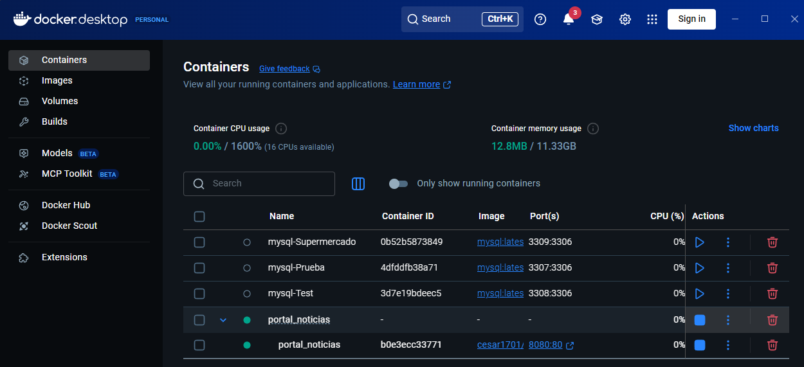
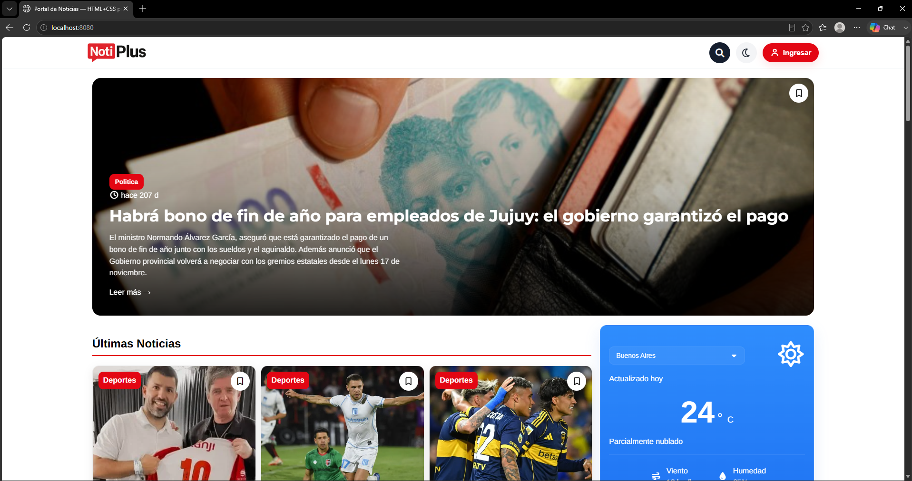
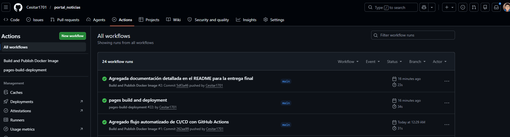

# 📰 NotiPlus — Portal de Noticias Digital Interactivo

¡Bienvenido a **NotiPlus**! Este proyecto es un portal de noticias moderno, rápido y adaptado para verse perfectamente tanto en computadoras como en celulares y tablets. 

Este repositorio fue creado como entrega para el **Trabajo Práctico N° 1 de Git y Docker**, abarcando desde el desarrollo de la aplicación hasta su empaquetado profesional en contenedores y la automatización de su subida a internet (DevOps).

---

## 🎯 ¿Qué hace este proyecto? 
Imaginalo de esta manera: normalmente, una página web común es como un folleto estático. NotiPlus es diferente porque es **interactivo y vivo**:
1. **Noticias desde la nube:** El contenido de las noticias no está escrito fijo en la página. Se descarga en tiempo real desde una base de datos en la nube llamada **Airtable**. Si el administrador agrega una noticia en Airtable, aparece en la web al instante.
2. **Finanzas al minuto:** Se conecta con un servicio externo de economía para mostrarte cuánto cotiza el Dólar (Oficial, Blue, MEP, CCL y Tarjeta) actualizado cada 5 minutos.
3. **Tu espacio personal:** Podés "Iniciar Sesión" con un usuario ficticio. La página recordará tu nombre y te permitirá "guardar" tus noticias favoritas en una sección de marcadores para leerlahs más tarde, usando la memoria de tu propio navegador.

---

## 🛠️ Tecnologías que hacen la magia
Para lograr este resultado, el proyecto combina las siguientes herramientas:
* **HTML5 y CSS3:** El esqueleto de la página y su diseño visual (colores, tipografías y adaptación a pantallas móviles).
* **JavaScript (Módulos ES6):** El "cerebro" que se encarga de hablar con internet, traer los dólares, manejar los clics de los usuarios y conectar con la base de datos.
* **Nginx:** El servidor web. Es un programa ultra rápido que se encarga de recibir a las visitas y mostrarles los archivos de la página.
* **Docker y Docker Compose:** Herramientas que empaquetan la página dentro de una "caja cerrada" (contenedor) para que funcione en cualquier computadora del mundo sin importar si es Windows, Mac o Linux.
* **GitHub Actions:** Un robot inteligente en internet que trabaja por nosotros. Cada vez que actualizamos el código, el robot se despierta solo, arma la caja de Docker y la sube a internet.

---

## 🚀 Cómo ejecutar este proyecto en tu computadora (Paso a Paso)

Esta guía está diseñada para que cualquier persona, incluso **sin conocimientos de programación**, pueda levantar y ver esta página web en su computadora en menos de 5 minutos utilizando **Docker**.

### 📋 Requisitos previos obligatorios
Antes de empezar, necesitás tener instaladas dos herramientas gratuitas en tu sistema:
1. **Git:** Descargalo e instalalo desde [git-scm.com](https://git-scm.com/). (Es el programa que nos permite descargar carpetas de código desde internet).
2. **Docker Desktop:** Descargalo desde [docker.com](https://www.docker.com/products/docker-desktop/). (Es el motor que va a encender nuestra página dentro de su contenedor). **¡Asegurate de abrir Docker Desktop y comprobar que tenga el ícono de abajo a la izquierda en color VERDE (Running) antes de seguir!**

---

### 🛠️ Instrucciones de despliegue

#### Paso 1: Descargar el proyecto
Abrí la consola de comandos de tu computadora (en Windows podés buscar `CMD` o `PowerShell`) y ejecutá la siguiente línea para clonar (descargar) este repositorio:

```bash
https://github.com/Cesitar1701/portal_noticias.git
```

Una vez que termine, ingresá a la carpeta que se acaba de crear escribiendo:

```bash
cd tu-repositorio
```

#### Paso 2: Configurar las credenciales y el entorno
Para que la página funcione, necesitamos crear dos pequeños archivos de texto con las configuraciones básicas dentro de esa misma carpeta.

1. **Configuración de las variables de Docker:** Crea un archivo llamado exactamente `.env` (con el punto adelante) y escribí adentro lo siguiente:
   ```env
   PORT=8080
   DOCKERHUB_USER=cesar1701
```

2. **Configuración de la Base de Datos:** Vas a ver un archivo llamado `env.example.js`. Copialo y cambiale el nombre a simplemente `env.js`. Abrilo con cualquier bloc de notas y colocá tus códigos privados de acceso de Airtable:
   ```javascript
   export const AIRTABLE_TOKEN = "tu_token_real_aqui";
   export const BASE_ID = "tu_base_id_real_aqui";
   export const TABLE_NAME = "Noticias";
```
   *Nota de seguridad: Gracias al archivo `.gitignore`, tu archivo `env.js` y tu archivo `.env` son totalmente secretos y nunca se subirán públicamente a internet.*

#### Paso 3: Encender la página web
Ahora viene la magia de Docker. En tu consola de comandos, dentro de la carpeta del proyecto, escribí la siguiente instrucción:

```bash
docker compose up -d
```

Docker leerá el archivo de configuración `docker-compose.yml`, descargará el servidor Nginx, inyectará los parámetros y el archivo local de credenciales, y creará un contenedor vivo en segundo plano.

#### Paso 4: ¡A disfrutar!
Abrí cualquier navegador web (Chrome, Edge, Firefox) y en la barra de direcciones de arriba escribí: 

👉 **http://localhost:8080**

¡Listo! Ya podés interactuar, navegar y probar el portal NotiPlus completo corriendo dentro de un contenedor Docker profesional de forma aislada.

Para apagar el entorno cuando termines, simplemente escribís en la consola: 

```bash
docker compose down
```

---

## 🤖 Automatización en la nube (CI/CD con GitHub Actions)
El proyecto cuenta con un flujo de trabajo automatizado de nivel profesional. En la carpeta `.github/workflows/deploy.yml` dejamos programadas las instrucciones para un "robot" de integración continua.

Cada vez que el desarrollador realiza un cambio en el código y lo sube a GitHub (`git push`):
1. **GitHub** detecta el cambio e inicia una computadora virtual en la nube.
2. El robot se conecta de forma segura a **Docker Hub** usando credenciales encriptadas de lo profundo del repositorio (`Secrets`).
3. Compila el archivo `Dockerfile` empaquetando la nueva versión de la web junto con Nginx.
4. Publica la imagen terminada en el perfil público de Docker Hub bajo el nombre de **`cesar1701/portal-noticias:latest`**, quedando disponible para que cualquier empresa o servidor del mundo pueda descargarla y usarla con una sola línea.

---

## 📸 Evidencias de Funcionamiento (Capturas del TP)

### Contenedor inicializado localmente en Docker Desktop


### Portal web funcionando en Localhost


### Automatización exitosa en GitHub Actions y Docker Hub


---

## 👤 Autor
* **Cesar Roberto Carlos** — Estudiante de Desarrollo de Software (ISTEA, 2026).